# 🎨 Design Patterns

<div align="center">

```
  ____            _               ____       _   _                      
 |  _ \  ___  ___(_) __ _ _ __   |  _ \ __ _| |_| |_ ___ _ __ _ __  ___ 
 | | | |/ _ \/ __| |/ _` | '_ \  | |_) / _` | __| __/ _ \ '__| '_ \/ __|
 | |_| |  __/\__ \ | (_| | | | | |  __/ (_| | |_| ||  __/ |  | | | \__ \
 |____/ \___||___/_|\__, |_| |_| |_|   \__,_|\__|\__\___|_|  |_| |_|___/
                    |___/                                                
```

**Reusable solutions to common software design problems**

[](.)
[](.)
[](.)

</div>

---

## 📖 What are Design Patterns?

Design Patterns are **proven solutions** to recurring problems in software design. They represent best practices and provide a template for how to solve problems that can be used in many different situations.

### Why Learn Design Patterns?

- ✅ **Proven Solutions**: Battle-tested approaches to common problems
- ✅ **Common Vocabulary**: Communicate design ideas effectively
- ✅ **Best Practices**: Learn from experienced developers
- ✅ **Flexibility**: Create maintainable and scalable code
- ✅ **Career Growth**: Essential knowledge for senior developers

---

## 🗂️ Pattern Categories

Design patterns are organized into three main categories:

```mermaid
graph TB
    DP[Design Patterns] --> C[🏗️ Creational]
    DP --> S[🔧 Structural]
    DP --> B[⚡ Behavioral]
    
    C --> C1[Object Creation]
    C --> C2[Instantiation]
    
    S --> S1[Object Composition]
    S --> S2[Structure]
    
    B --> B1[Object Interaction]
    B --> B2[Communication]
    
    style DP fill:#a29bfe,stroke:#6c5ce7,stroke-width:3px,color:#fff
    style C fill:#74b9ff,stroke:#0984e3,stroke-width:2px
    style S fill:#55efc4,stroke:#00b894,stroke-width:2px
    style B fill:#fdcb6e,stroke:#e17055,stroke-width:2px
```



---

## 🏗️ Creational Patterns

**Focus**: Object creation mechanisms

These patterns deal with object creation, trying to create objects in a manner suitable to the situation.

| Pattern | Purpose | Use When |
|---------|---------|----------|
| **Singleton** | Ensure only one instance exists | Need exactly one object (DB connection, logger) |
| **Factory Method** | Create objects without specifying exact class | Object type determined at runtime |
| **Abstract Factory** | Create families of related objects | Need to create related objects together |
| **Builder** | Construct complex objects step by step | Object has many optional parameters |
| **Prototype** | Clone existing objects | Creating new objects is expensive |

### Quick Example: Singleton

```java
public class Database {
    private static Database instance;
    
    private Database() {}  // Private constructor
    
    public static Database getInstance() {
        if (instance == null) {
            instance = new Database();
        }
        return instance;
    }
}
```

---

## 🔧 Structural Patterns

**Focus**: Object composition and relationships

These patterns deal with object composition, creating relationships between objects to form larger structures.

| Pattern | Purpose | Use When |
|---------|---------|----------|
| **Adapter** | Make incompatible interfaces work together | Need to use existing class with incompatible interface |
| **Bridge** | Separate abstraction from implementation | Want to avoid permanent binding |
| **Composite** | Treat individual objects and compositions uniformly | Need tree structures |
| **Decorator** | Add responsibilities to objects dynamically | Need to add features without subclassing |
| **Facade** | Provide simplified interface to complex system | Want to hide complexity |
| **Flyweight** | Share objects to support large numbers efficiently | Many similar objects needed |
| **Proxy** | Provide placeholder for another object | Need to control access to object |

### Quick Example: Decorator

```java
interface Coffee {
    double cost();
}

class SimpleCoffee implements Coffee {
    public double cost() { return 5.0; }
}

class MilkDecorator implements Coffee {
    private Coffee coffee;
    
    public MilkDecorator(Coffee coffee) {
        this.coffee = coffee;
    }
    
    public double cost() {
        return coffee.cost() + 1.5;  // Add milk cost
    }
}
```

---

## ⚡ Behavioral Patterns

**Focus**: Object interaction and responsibility

These patterns deal with object collaboration and the delegation of responsibilities.

| Pattern | Purpose | Use When |
|---------|---------|----------|
| **Observer** | Notify multiple objects of state changes | One-to-many dependency needed |
| **Strategy** | Define family of algorithms, make them interchangeable | Multiple algorithms for same task |
| **Command** | Encapsulate request as object | Need to parameterize, queue, or log operations |
| **State** | Change behavior when internal state changes | Object behavior depends on state |
| **Template Method** | Define algorithm skeleton, let subclasses override steps | Algorithm structure is fixed, steps vary |
| **Iterator** | Access elements sequentially without exposing structure | Need to traverse collection |
| **Mediator** | Define object that encapsulates how objects interact | Complex communication between objects |
| **Memento** | Capture and restore object state | Need undo/redo functionality |
| **Chain of Responsibility** | Pass request along chain of handlers | Multiple objects can handle request |
| **Visitor** | Add operations to objects without modifying them | Need to perform operations on object structure |
| **Interpreter** | Define grammar and interpreter for language | Need to interpret language or expressions |

### Quick Example: Strategy

```java
interface PaymentStrategy {
    void pay(int amount);
}

class CreditCardPayment implements PaymentStrategy {
    public void pay(int amount) {
        System.out.println("Paid " + amount + " using Credit Card");
    }
}

class PayPalPayment implements PaymentStrategy {
    public void pay(int amount) {
        System.out.println("Paid " + amount + " using PayPal");
    }
}

class ShoppingCart {
    private PaymentStrategy paymentStrategy;
    
    public void setPaymentStrategy(PaymentStrategy strategy) {
        this.paymentStrategy = strategy;
    }
    
    public void checkout(int amount) {
        paymentStrategy.pay(amount);
    }
}
```

---

## 🎯 Pattern Selection Guide


---

## 📚 Learning Path


---

## 🚀 Quick Start

```bash
# Navigate to pattern category
cd Design-Patterns/Creational
cd Design-Patterns/Structural
cd Design-Patterns/Behavioral

# Compile and run examples
javac SingletonPattern.java
java SingletonPattern
```

---

## 💡 When to Use Design Patterns

✅ **Use patterns when**:
- Problem matches pattern's intent
- Pattern simplifies the solution
- Team understands the pattern
- Benefits outweigh complexity

❌ **Don't use patterns when**:
- Forcing pattern where it doesn't fit
- Over-engineering simple problems
- Team is unfamiliar with pattern
- Adds unnecessary complexity

---

## 🎓 Pattern Relationships


---

## 📖 Resources

- **Books**: 
  - "Design Patterns" by Gang of Four (GoF)
  - "Head First Design Patterns"
- **Practice**: Implement each pattern in your own projects
- **Code Reviews**: Identify patterns in existing codebases

---

## 🎯 Next Steps

1. ✅ Master SOLID principles first
2. 📚 Start with Creational patterns
3. 🔧 Move to Structural patterns
4. ⚡ Learn Behavioral patterns
5. 🚀 Apply in real projects

---

<div align="center">

**🔜 Coming Soon: Detailed examples for each pattern!**

[](../README.md)

</div>
