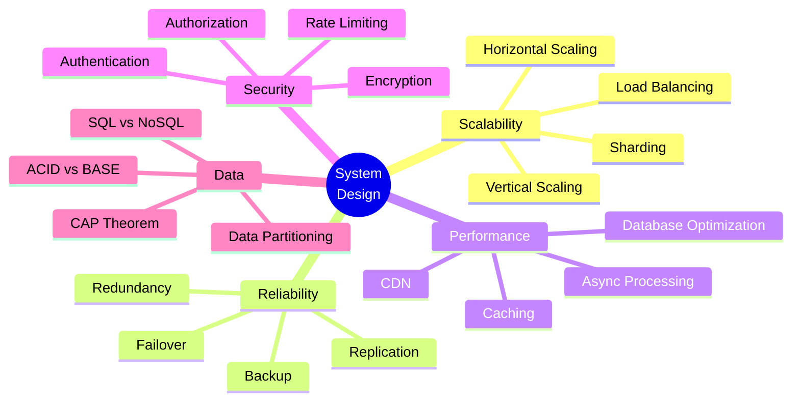
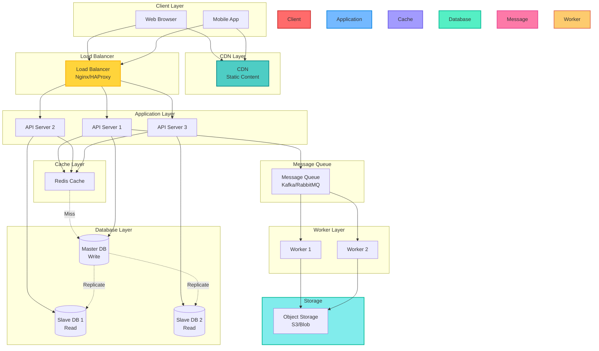
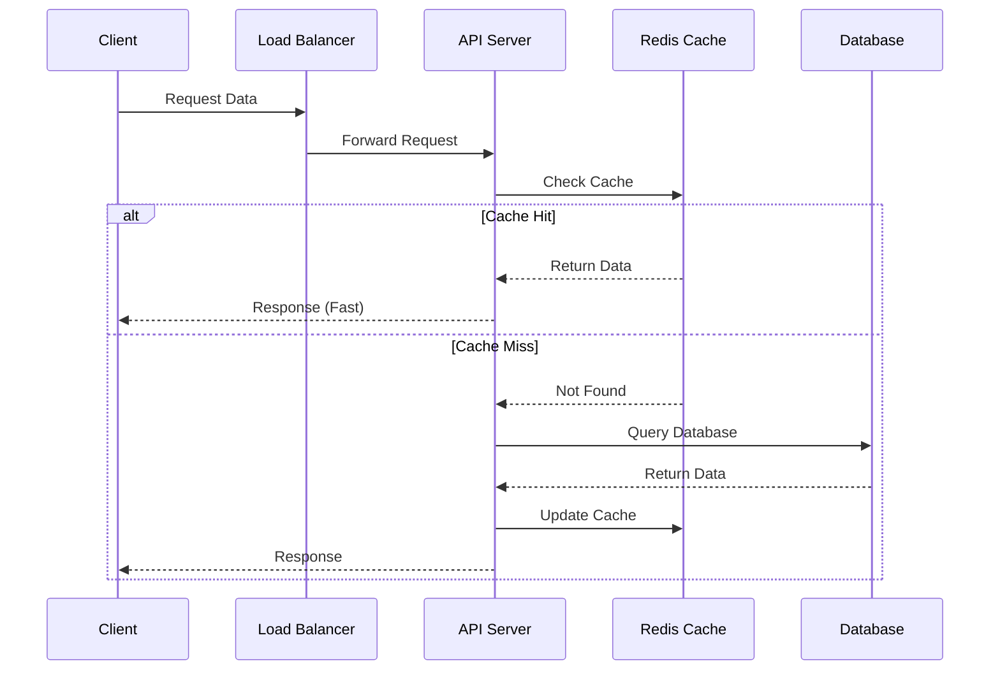
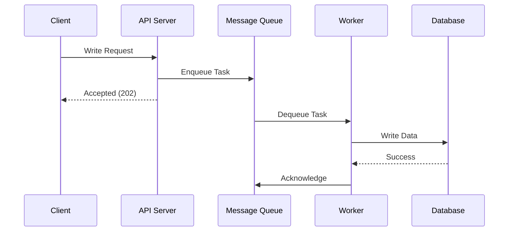
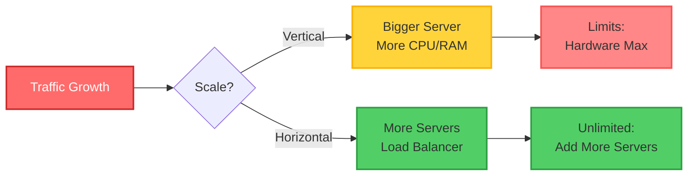
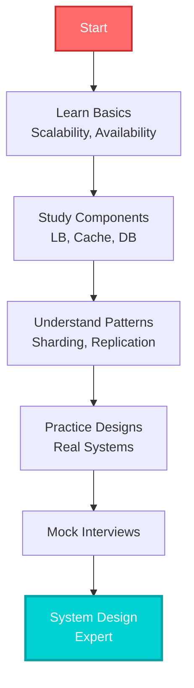

# 🚀 System Design Patterns

<div align="center">

```
  ____            _                   ____            _             
 / ___| _   _ ___| |_ ___ _ __ ___   |  _ \  ___  ___(_) __ _ _ __  
 \___ \| | | / __| __/ _ \ '_ ` _ \  | | | |/ _ \/ __| |/ _` | '_ \ 
  ___) | |_| \__ \ ||  __/ | | | | | | |_| |  __/\__ \ | (_| | | | |
 |____/ \__, |___/\__\___|_| |_| |_| |____/ \___||___/_|\__, |_| |_|
        |___/                                            |___/        
```

**Build Scalable, Reliable, and High-Performance Systems**

[](.)
[](.)
[](.)

</div>

---

## 📖 What is System Design?

System Design is the process of defining the **architecture**, **components**, **modules**, **interfaces**, and **data** for a system to satisfy specified requirements.

### Why Learn System Design?

- ✅ **Build Scalable Systems**: Handle millions of users
- ✅ **High Availability**: Keep systems running 24/7
- ✅ **Performance**: Fast response times
- ✅ **Career Growth**: Essential for senior/architect roles
- ✅ **Interview Success**: Common in tech interviews

---

## 🎯 Core Concepts



---

## 🏗️ System Design Patterns

### 1. Load Balancing

**Problem**: Single server can't handle all traffic
**Solution**: Distribute requests across multiple servers

```
Client → Load Balancer → Server 1
                      → Server 2
                      → Server 3
```

**Algorithms**:
- Round Robin
- Least Connections
- IP Hash
- Weighted Round Robin

---

### 2. Caching

**Problem**: Database queries are slow
**Solution**: Store frequently accessed data in memory

```
Client → Cache (Redis/Memcached) → Database
         ↓ Hit                      ↑ Miss
      Response                   Fetch & Cache
```

**Strategies**:
- Cache-Aside
- Write-Through
- Write-Behind
- Refresh-Ahead

---

### 3. Database Sharding

**Problem**: Single database can't handle all data
**Solution**: Split data across multiple databases

```
User ID 1-1000    → Shard 1
User ID 1001-2000 → Shard 2
User ID 2001-3000 → Shard 3
```

---

### 4. Microservices

**Problem**: Monolithic app is hard to scale
**Solution**: Break into independent services

```
Monolith → User Service
        → Order Service
        → Payment Service
        → Notification Service
```

---

### 5. Message Queue

**Problem**: Synchronous processing is slow
**Solution**: Async processing with queues

```
Producer → Queue (RabbitMQ/Kafka) → Consumer
```

---

## 📊 System Architecture Patterns



---

## 🔄 Data Flow Patterns

### Read-Heavy System



### Write-Heavy System



---

## 🎯 Design Principles

### CAP Theorem

```
Pick 2 out of 3:
┌─────────────┐
│ Consistency │ ← All nodes see same data
├─────────────┤
│ Availability│ ← System always responds
├─────────────┤
│ Partition   │ ← Works despite network failures
│ Tolerance   │
└─────────────┘
```

### ACID vs BASE

| ACID (SQL) | BASE (NoSQL) |
|------------|--------------|
| Atomicity | Basically Available |
| Consistency | Soft state |
| Isolation | Eventually consistent |
| Durability | - |

---

## 📈 Scalability Patterns



---

## 🛠️ Technology Stack

| Layer | Technologies |
|-------|-------------|
| **Load Balancer** | Nginx, HAProxy, AWS ELB |
| **Cache** | Redis, Memcached |
| **Database** | MySQL, PostgreSQL, MongoDB, Cassandra |
| **Message Queue** | Kafka, RabbitMQ, AWS SQS |
| **Search** | Elasticsearch, Solr |
| **Storage** | AWS S3, Azure Blob, Google Cloud Storage |
| **CDN** | Cloudflare, AWS CloudFront, Akamai |
| **Monitoring** | Prometheus, Grafana, ELK Stack |

---

## 📚 Common System Design Questions

1. **Design URL Shortener** (like bit.ly)
2. **Design Twitter** (social media feed)
3. **Design Instagram** (photo sharing)
4. **Design Uber** (ride-sharing)
5. **Design Netflix** (video streaming)
6. **Design WhatsApp** (messaging)
7. **Design YouTube** (video platform)
8. **Design Amazon** (e-commerce)

---

## 🚀 Learning Path



---

<div align="center">

**🔜 Coming Soon: Detailed system design examples!**

[](../README.md)

**Happy Designing! 🚀**

</div>
